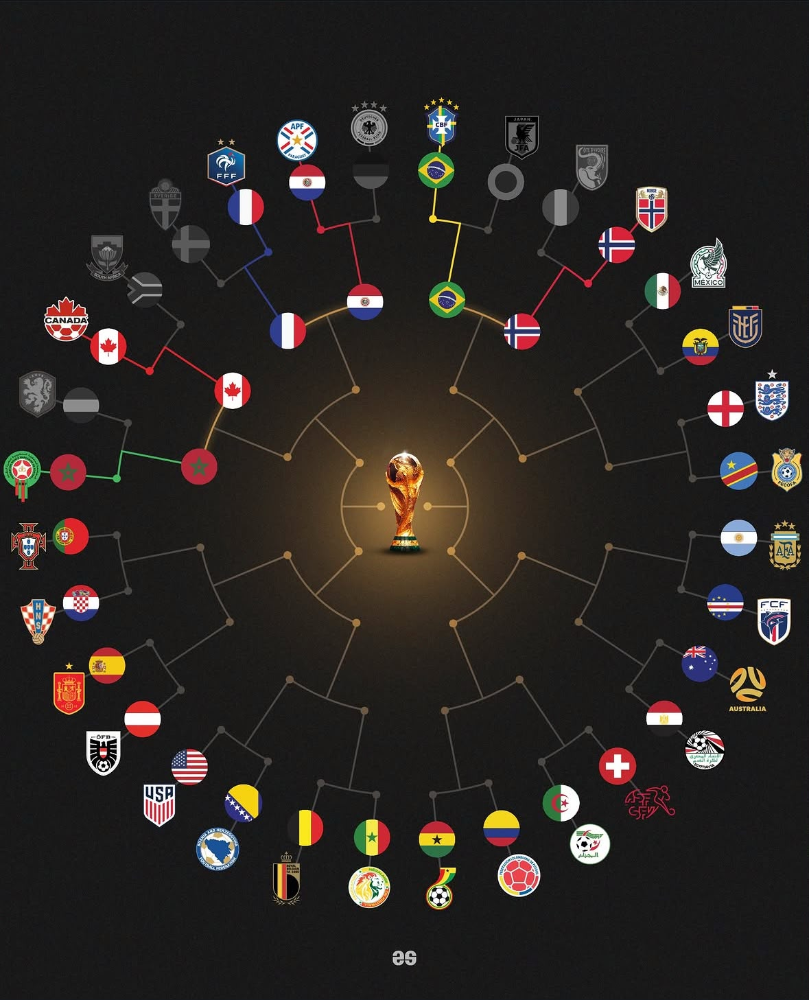

> **Kickoff — session 1.** Launch with `/goal` — see `docs/workshop/kickoff-prompts.md` for the exact
> condition. How goal-driven tasks work: `docs/engineering/goal-oriented-tasks.md`. CLAUDE.md (auto-loaded) has the conventions.

# Workstream: Punter Web

**You own:** `apps/punter-web/` — nothing else.
**Port:** 5173 · **Consumes:** pricing :4001, betting :4002, simulator :4003, flags :4004 · **Read-only:** `contracts/`

## Mission

The public face of the platform — a dark, premium sportsbook. **The home page _is_ the bracket:**
a circular "Road to the Final" radiating from a glowing golden trophy — the screen everyone
photographs. Around it, punters open a wallet of donut dollars, browse odds, place bets, and watch
their bets and the bracket resolve live when the tournament is simulated.

## The look — build to this key art



`docs/specs/assets/road-to-the-final.jpg` is the north star. Match its language: a **near-black
arena**; teams as **circular nodes around the rim**; **concentric rings converging inward**
(R32 → R16 → QF → SF → Final) to a **glowing golden trophy at dead centre**; **winner paths lit in
the winner's colour**, undecided/eliminated paths **dim grey**. A constellation collapsing toward
the trophy. We ship a faithful **interpretation** in hand-rolled SVG using the data we have (emoji
flags + names) — see **Images & assets** for why it's not a pixel copy of the crests.

## Page anatomy

```
┌─────────────────────────────────────────────────────────────┐
│  ROAD TO THE FINAL        Markets  Bet Slip  My Bets   🍩 10,000 · Ana ▾ │  ← sticky header
├─────────────────────────────────────────────────────────────┤
│                                                             │
│                    ◐   ◐   ◐   ◐   ◐                         │
│                ◐                       ◐                     │
│             ◐         ·  ·  ·  ·         ◐                   │  ← the bracket
│           ◐        ·               ·       ◐                 │    (home, full-bleed,
│           ◐       ·      🏆(glow)   ·      ◐                 │     ~92vmin, centred)
│           ◐        ·               ·       ◐                 │
│             ◐         ·  ·  ·  ·         ◐                   │
│                ◐                       ◐                     │
│                    ◐   ◐   ◐   ◐   ◐                         │
│                                                             │
└─────────────────────────────────────────────────────────────┘
   (Bet slip slides in from the right as a drawer, over any page.)
```

- **Sticky header** (full width, dark, thin bottom border): brand wordmark left → home; nav in the
  middle (items appear as flags flip); **wallet chip** right (balance + name → profile menu).
- **Home `/` = the bracket, full-bleed**, centred under the header — the landing page and the
  signature screen, not a menu item. Gated by `punter-bracket`; dark → minimal hero (§6).
- **Bet slip** is a right-hand **drawer** available from any page (not its own route).
- **Routes:** `/` (bracket) · `/markets` · `/my-bets` · `/status`.

## Where the data comes from

| Element on screen                       | Source                                    | Join / notes                                                       |
| --------------------------------------- | ----------------------------------------- | ------------------------------------------------------------------ |
| Brand wordmark                          | static app constant                       | text, no image asset                                               |
| Punter name + balance (wallet chip)     | betting `POST` / `GET :4002/accounts/:id` | `accountId` cached in `localStorage`; **name is the identity**     |
| Bracket structure (rounds, matchups)    | `@arena/contracts` `FIXTURES`             | linked by `feedsInto` / `feedsIntoSlot`; fixture `id` e.g. `R16-2` |
| Bracket results (scores, winner, champ) | simulator `GET :4003/state`               | keyed by fixture `id`                                              |
| Team flag + name                        | `@arena/contracts` `TEAMS`                | `flag` is an **emoji**; fixture `homeTeamId`/`awayTeamId` → team   |
| Odds on a fixture                       | pricing `GET :4001/markets`               | **join `Market.fixtureId` === fixture `id`**                       |
| Title / outright odds                   | pricing `GET :4001/outright`              | `Market.fixtureId === null`                                        |
| Placing a bet                           | betting `POST :4002/bets`                 | needs `Market.id` + `Selection.id` + `acceptedPrice`               |
| My bets                                 | betting `GET :4002/bets?accountId=`       |                                                                    |
| Feature gating                          | flags `GET :4004/flags`                   | which surfaces render (§6)                                         |
| `/status` health dots                   | each service `GET /health`                | scaffold already does this                                         |

## Images & assets

- **Team flags = emoji from `TEAMS[].flag`** (e.g. `🇨🇦`). No flag-image files, no CDN — native
  emoji, zero dependencies. (Caveat: flag emoji render flat on Windows; fine on the host's Mac and
  phones. If you want crisper flags, that's a design decision to raise — don't add a dependency
  unprompted.)
- **No federation crests / logos.** The key art uses real crests; we don't have them and won't
  fetch them — trademark/IP on a public site, and it'd be an external dependency. Nodes are
  **flag emoji + team name**.
- **The trophy = a `🏆` emoji (or a simple hand-drawn SVG silhouette) with a golden
  radial-gradient glow** behind it. **Do not use a photo of the real World Cup trophy** —
  trademark/IP for a public, pentested app.
- **Brand = a text wordmark** ("ROAD TO THE FINAL", condensed bold). No logo image exists; the
  visual identity is the wordmark + the trophy motif. No Sportsbet references anywhere.

## Requirements

### 1. Identity, wallet, profile & logout — passwordless, robust, recoverable

No passwords (donut dollars, not real money). **A punter's name is their identity.**

- **First visit / no session:** an identity gate — _"Enter your punter name. You'll start with
  10,000 donut dollars."_ On submit, `POST :4002/accounts { name }`, which is
  **find-or-create by name**: an existing name returns that account (balance + bets intact — this
  is how you sign back in on a new device or after clearing storage); a new name opens an account
  with `OPENING_BALANCE` (**10,000**). Persist `{ accountId, name }` in `localStorage`, and **show
  the returned balance** so a returning punter sees _"welcome back — 8,420"_.
- **Returning (cached):** on load, if `localStorage` has an `accountId`, `GET :4002/accounts/:id`
  to confirm + **refresh balance**. On 404 (DB reset / stale id), clear the cache and re-show the
  gate — never leave a broken session live.
- **Wallet chip (header, right):** always shows **`🍩 {balance} · {name}`**, balance starting at
  **10,000**, updated after every bet and on every poll during a sim run.
- **Profile menu** (click the wallet chip): name, live balance, **Switch punter** (re-open the
  gate), **Log out**.
- **Log out = local sign-out only:** clear `{accountId,name}` from `localStorage` → back to the
  gate. The account and balance **persist server-side** and are recoverable by re-entering the
  name. No account deletion, no separate profile page — My Bets (§5) is the history.
- You are never the only account — bots and other punters exist.

### 2. The bracket — the home page & signature screen

Full-bleed radial SVG at `/`, built to the key art.

- **Size & position:** a square SVG (`viewBox="0 0 1000 1000"`, centre `(500,500)` = the trophy)
  scaled by CSS to `min(92vw, 92vh)` and centred under the header — it dominates the screen. Stays
  circular and legible on a phone (people photograph it on their phones).
- **Geometry (data-driven radial layout):** group `FIXTURES` by round; assign each round a ring
  radius, outer → inner: **R32 ≈ 460, R16 ≈ 360, QF ≈ 250, SF ≈ 150, F ≈ 70**, trophy at centre.
  Place the outer-round teams around the full circle by angle (a fixture's two teams adjacent);
  each fixture's winner-slot sits on the next inner ring at the mean angle of its feeders, found
  via `feedsInto` / `feedsIntoSlot`. Draw an edge from each team node inward to its winner-slot.
  Convert polar (angle, radius) → cartesian yourself; **no layout library**. The real bracket is
  slightly irregular (24 teams; some enter at R16) — lay out from the data, don't hard-code a
  32-leaf tree.
- **Node anatomy:** a team node = a filled circle (~36 units) with the **flag emoji** centred and
  the **short team name** labelled outside it. A winner-slot before it's decided = a small grey
  dot; once decided, it becomes the winner's node, lit.
- **Live state (`GET :4003/state`, keyed by fixture `id`):** played fixtures show the **score**;
  the **winner's path lights up gold** toward the centre; loser and unplayed branches stay **dim
  grey**; eliminated teams dim. When `SimState.champion` is set, the champion's flag docks beside
  the trophy at full glow.
- **Connecting to the market (dynamic):** the join key is the **fixture `id`**. Fetch
  `GET :4001/markets` (~5s) and build a `Map<fixtureId, Market>`. For each fixture, look up its
  market: if present and `status === 'open'`, the node/card shows the two **prices** and is
  **bettable**; if absent (a future fixture with unknown teams — not priceable) or `settled`, it's
  structure-only. The market's two `selections` are the two teams — match `selection.name` to the
  team's `name` from `TEAMS` (selections carry no `teamId`). Prices that change between polls
  **flash**. So one poll drives odds, another (`/state`) drives results, and `fixtureId` keeps them
  in lockstep.
- **Hover (desktop):** hovering a **team** highlights **its whole path to the centre** (its branch
  brightens/thickens, the rest dims) and shows a tooltip (team name + its price in the current
  fixture, or its outright title price). Hovering a **fixture** highlights the two nodes + their
  edge and shows the matchup, status/score, and prices if open. Cursor `pointer` on anything
  clickable. On touch (no hover), a tap does the highlight + opens the detail card.
- **Click:** clicking a **fixture** opens a **detail card** anchored near it — the two teams
  (flag + name), round, kickoff time or final score, status, and (if its market is `open` and
  `punter-bet-slip` is on) two **price buttons** that open the bet slip pre-filled with
  `{ marketId, selectionId, price }`. Clicking the **trophy/centre** opens the **outright market**
  (`GET :4001/outright`) if `punter-markets` is on. Dark/absent market → the card is info-only.
- **Animation:** ambient — the trophy glow **pulses** (~3s) and lit paths shimmer faintly. On a new
  result during a run (detected via the `/state` poll, ~1s while a run is active) the winning path
  transitions **grey → gold over ~600ms** with a glow bloom, the winner node **pops**, the loser
  dims — cascading ring by ring inward. The champion flare + confetti (if `punter-confetti`) closes
  it. CSS/SVG only, **no animation library**.
- **Dark fallback:** while `punter-bracket` is dark, `/` shows a **minimal branded hero** (wordmark
  - pulsing trophy glow + "Road to the Final") — not a bracket teaser. Flipping the flag reveals
    the full bracket in place; that flip is the show's first big reveal.

### 3. Markets page (`/markets`, flag `punter-markets`)

- Fixtures with odds from `GET :4001/markets`, **grouped by round**, team names + flags from
  `TEAMS`. Two-way match-winner markets; each `Selection` is a **price button**.
- Poll ~5s; a price that changed since last poll **flashes** (green up / red down).
- Suspended / settled markets render clearly non-clickable.
- Clicking a price opens/updates the **bet slip** (§4) with `{ marketId, selectionId, price }`.

### 4. Bet slip (drawer, flag `punter-bet-slip`)

- A slip available from any page: **selection, current price, stake input, potential return**
  (`stake × price`), and the **balance it will leave** — validate `stake ≤ current balance`
  client-side (the server is the referee, but don't offer an impossible bet).
- Submit `POST :4002/bets` with a **fresh `crypto.randomUUID()` idempotency key** and the displayed
  price as `acceptedPrice`.
- **409 price-moved:** show the new price and ask again (accept → resubmit with a new key; cancel →
  drop it). Never silently place at a changed price.
- On success: refresh balance from the account, confirm, clear the slip.

### 5. My bets (`/my-bets`, flag `punter-my-bets`)

- `GET :4002/bets?accountId=` — **pending / won / lost**, each with stake, price, and
  potential/actual return. Poll during sim runs so they **flip live** as settlements land.

### 6. Everything ships dark — feature flags + local-dev bypass

Poll `GET :4004/flags` (~3s); render each feature only when its flag is on: `punter-markets` →
markets, `punter-bet-slip` → bet slip, `punter-my-bets` → my bets, `punter-bracket` → the bracket
on `/`, `punter-confetti` → confetti. **Dark means _absent_** — no teasers, no disabled stubs (home
falls back to the minimal hero when `punter-bracket` is dark). A flag flip reveals its feature
within seconds, no reload — this is how the host releases live during the show.

**Local dev shows everything:** gate on `import.meta.env.DEV || flag.enabled`, so `npm run dev`
reveals every feature (Vite sets `DEV` true in the dev server, false in production builds) — you
never flip a production flag just to develop.

### 7. Scaffold surfaces to keep

The scaffold already provides the **flag-driven nav** and the **`/status`** health page — keep both
working, and build each feature as the page behind its nav item.

All service URLs must resolve as `import.meta.env.VITE_<SERVICE>_URL ?? BASE_URLS.<service>` (see the
scaffold's `App.tsx`) — the same build runs on localhost and on Vercel against the Render services.

## What's clickable

| Target                           | Action                                                                  |
| -------------------------------- | ----------------------------------------------------------------------- |
| Brand wordmark                   | → home (the bracket)                                                    |
| Nav links (Markets/Slip/My Bets) | → that page (appear as flags flip)                                      |
| Wallet chip                      | → profile menu (name, balance, Switch punter, Log out)                  |
| Bracket **fixture** node/edge    | → detail card → price buttons → **bet slip** (if market open + flag on) |
| Bracket **trophy / centre**      | → outright (title) market (if `punter-markets` on)                      |
| Market **price button**          | → bet slip pre-filled                                                   |
| Bet-slip **place**               | → `POST /bets`                                                          |
| Identity gate / Switch punter    | → `POST /accounts` (find-or-create)                                     |

Team nodes are **hover-highlight**, click routes through their fixture. Everything else (labels,
rings, background) is non-interactive.

## Visual & motion language

- **Palette:** near-black arena; warm **gold** for the trophy, its glow, and winning paths;
  team-evocative accents on lit paths; muted greys for undecided / eliminated.
- **Motion:** one hero motion (the bracket collapsing) — plus price flashes and the champion
  confetti. Tasteful, not everything moving.
- **Hand-rolled SVG + CSS only** — no chart, layout, or animation libraries.

## Enterprise bar

- A typed fetch layer that zod-parses every response against contract schemas — no `any` data.
- Components tested with Testing Library (mocked fetch): identity gate + recovery + logout, header
  balance, markets render + price flash, slip math + 409 flow, bracket rendering + a decided
  fixture lighting its path, fixture-click → bet slip. ≥85% coverage on everything you commit; zero
  lint warnings.
- No new dependencies — SVG by hand, CSS animations, native fetch, emoji flags.

## Definition of Done

Meet the **gates in `docs/engineering/definition-of-done.md`** (run and paste the evidence). Plus
prove these — paste the name of the test for each:

- The **bracket is the home route `/`**, lays out from `FIXTURES` (by round/ring, linked by
  `feedsInto`), and a decided fixture from `/state` lights its winner's path toward the centre
- A fixture node reads its odds by **`Market.fixtureId` join** and clicking it opens the bet slip
  with the right `marketId` / `selectionId`
- **Identity is find-or-create by name** (a repeated name returns the same account) and a stale
  cached `accountId` (404) falls back to the gate; **Log out** clears local state only
- The header shows the **balance starting at 10,000** and updates after a bet
- Each feature is gated on `import.meta.env.DEV || flag.enabled` — both modes proven
- The bet slip submits with a fresh idempotency key and recovers gracefully from a 409

## Demo moment

The finale: the simulator runs, and for two minutes the bracket eats itself alive — paths igniting
ring by ring until one flag sits beside the trophy. Bets flip to won/lost in the corner, and the
balance in the header jumps as it happens.

## Stretch

- **Recovery code:** issue a one-time code on account creation so a name can't be impersonated —
  recovery becomes name + code (replaces find-or-create-by-name-only if you do this).
- Cash-out teaser: live value of pending bets as odds move.
- Confetti burst (CSS only) when the champion is decided.
